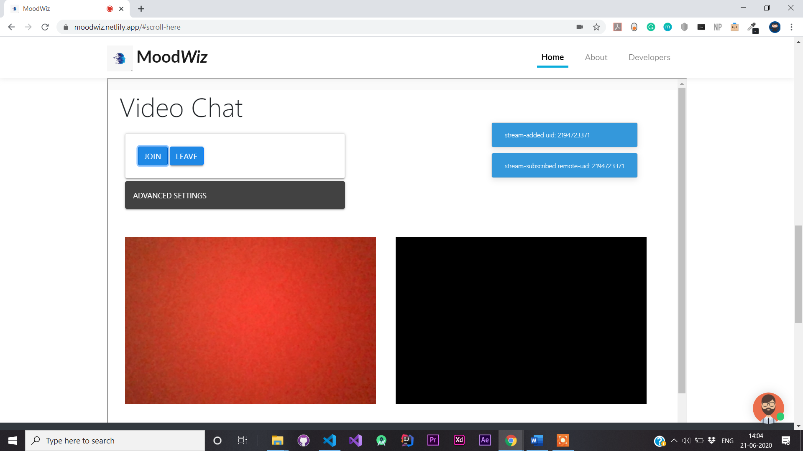

# Team codeBlooded for HackJaipur

Official Entry of Team codeBlooded, from SRM Institute of Science and Technology, Kattankulathur, to HackJaipur.  

  

## Links to HackJaipur

- [Devfolio](https://devfolio.co/hackjaipur/)
- [Official Website](https://www.hackjaipur.com/)
- [MLH](https://mlh.hackjaipur.com/)
- [Code of Conduct](https://static.mlh.io/docs/mlh-code-of-conduct.pdf?fbclid=IwAR2vbP-bruJ_ZyL9D0bamJ-15OxadEtm0tv4l1EYBBkNnJ5-6XoUe0Zd2ZE)

## Track and Problem Statement 🚧

We are integrating three tracks with our project, namely:

- **Tech and Health**: Technology can create sustainable and effective relations between a healthcare professional and the patient. It can also provide a cheaper, faster, and more beneficial solutions to prevent and battle illnesses.
- **Diversity**: Diversity means the inclusion of all individuals as technology does not discriminate.
- **Creating Awareness**: With the increase in the use of technology, the dangers have also increased. Awareness is the first step towards creating a better society and community. Awareness can be social, technical, or general.
  - **Problem Statement**: Mental Health Assessment and Aid

## Background 📖

A report by the World Health Organisation (WHO) revealed that 7.5 per cent of the Indian population suffers from some form of mental disorder. Mental illnesses constitute one-sixth of all health-related disorders and India accounted for nearly 15% of the global mental, neurological and substance abuse disorder burden. The treatment gap, which is defined as the prevalence of mental illnesses and the proportion of patients that get treatment, is over 70 per cent. WHO also predicts that by 2020, roughly 20 per cent of India will suffer from mental illnesses. And to cater to this demographic, we have less than 4,000 mental health professionals.
[Source](https://economictimes.indiatimes.com/magazines/panache/mental-health-in-india-7-5-of-country-affected-less-than-4000-experts-available/articleshow/71500130.cms?utm_source=contentofinterest&utm_medium=text&utm_campaign=cppst)

In our country, the discovery of a mental illness is often followed by denial and hesitation to seek help. Despite its enormous social burden, mental health remains a taboo subject that is susceptible to age-old stigmas, prejudices and fears. Even though mental disorders can be cured or controlled, most people tend to sweep their issues under the carpet and suffer in silence. Not only do we need to actively foster awareness about mental health, we also need to create awareness about the absurdity of the stigmas attached to mental health, in order to eradicate them.

**Be Kind to your Mind**

## About Our Product 🔧
### What
We at Team codeBlooded, propose a Web Application which is preventive and most importantly affordable. Our Web App called, **'MoodWiz'**, serves the purpose of Self Discovery without the hassle of having to create an account, and for troubled individuals we have features like an on screen Sketch Board, Videoconferencing feature, so you can reach out to a Psychologist or a Counselor, amidst a lot of other features. All information is provided by the user voluntarily and all communication is client side. We do not store any data, as Security of the Application is our priority. The WebApp provides minimalist interface aimed at users from all age groups and.

### Why
As highlighted in the background as well, most people in our society think of mental illnesses or disorders like a taboo. It is high time now that we normalize mental disorders like any other disease, like cancer or diabetes. We need to understand that people with Mental Illnesses need acceptance and guidance. Given the current ratio of Patients to Mental Health Professionals, we are emphasizing on *Raising the Line* to help address these issues. We at Team codeBlooded, have consulted with Counselors and Psychologists to understand the needs of those who require help with their mind and have curated a Web Application that will definitely be beneficial to our society with proper implementation.

### How
With our Web Application we offer the following features:

- ***Discover***
  - **Read** about how you can understand your mind, understand yourself. Know about ways you can use to understand your emotions.
  - **Watch** videos recorded by Mental Health Professionals* on ways you can use to tackle different emotions, boost your confidence, and inculcate good habits.
  - **Listen** to Music that calms you down, words of Psychologists that help you develop a positive attitude, a positive approach towards life.
  - **Online Sketchboard** that you can use to draw your heart out, and we won't save anything that you create!
- ***Connect***
  - **Videochat** and connect with available Psychologists and Counselors if you want someone to lend you an ear. With an inbuilt Suggestions Box, the Mental Health Professional can recommend ways with which you can be a better version of yourself.
  - **Chatbot** that assesses your mental state and recommends jokes to you so no matter how you're feeling, you end up smiling!
  - **Speeches** to motivate you to do better.
  - **Habit Tracker** that you can download and print, to help you inculcate good habits and kick out the bad ones.
  

## Installation and Execution

You can visit the link or follow these steps:

1. Clone this repository.
2. Open index.html.
3. Make sure you have active Internet Connection so the Web Application functions best (Google DialogFlow Chatbot requires access to the Internet).

## Timeline ⏰

- Week 1: Research and Initial Documentation (14th-20th June)
- Week 2: Development (20th-21st June)
- Week 3: Product and Pitch Submission (21st June)

## Technology Principles Implemented 💡

1. Cloud First
2. Mobile First
3. Minimalist Design
4. Reusable

## Technology Stack 💻

- Firebase
- Azure
- Kotlin (For a WebView App)
- HTML, CSS, JavaScript
- Google Cloud DialogFlow
- Collect.chat
- GitHub Actions
- Agora.io

## Use Cases 🤝

- In a Country with a population of 138 Crores, Web Applications like MoodWiz can help people stay sane and even give some people hope. In India, for every 100,000 people, 11 People end up taking their lives because of unavailability of help. We try our level best to reduce that number by providing effective ways one can implement to lead a better life.
  - [Indian Suicide Data](https://www.ncbi.nlm.nih.gov/pmc/articles/PMC6902359/)
- Due to it's reusability, our Web Application can be modified really easily to help cover more issues.

## Future Upgrades 👀

- Implementation of AIML Models to understand user pattern.
- Feature to upload files for the *Discover* Section, material can be added after carefully reviewing it.
- Add support for people going through clinically verified Mental Disorders (requires evaluation).
- Personalized experience with a Login Account.

## Collaborators 🤖

- [Aaishika S Bhattacharya](https://www.github.com/aaishikasb) - Team Lead
- [Souharda Biswas](https://www.github.com/TheSouharda)
- [Akash Ramjyothi](https://www.github.com/akash-ramjyothi)
- [Gyanesh Samanta](https://www.github.com/Gyanesh-Samanta-123)
